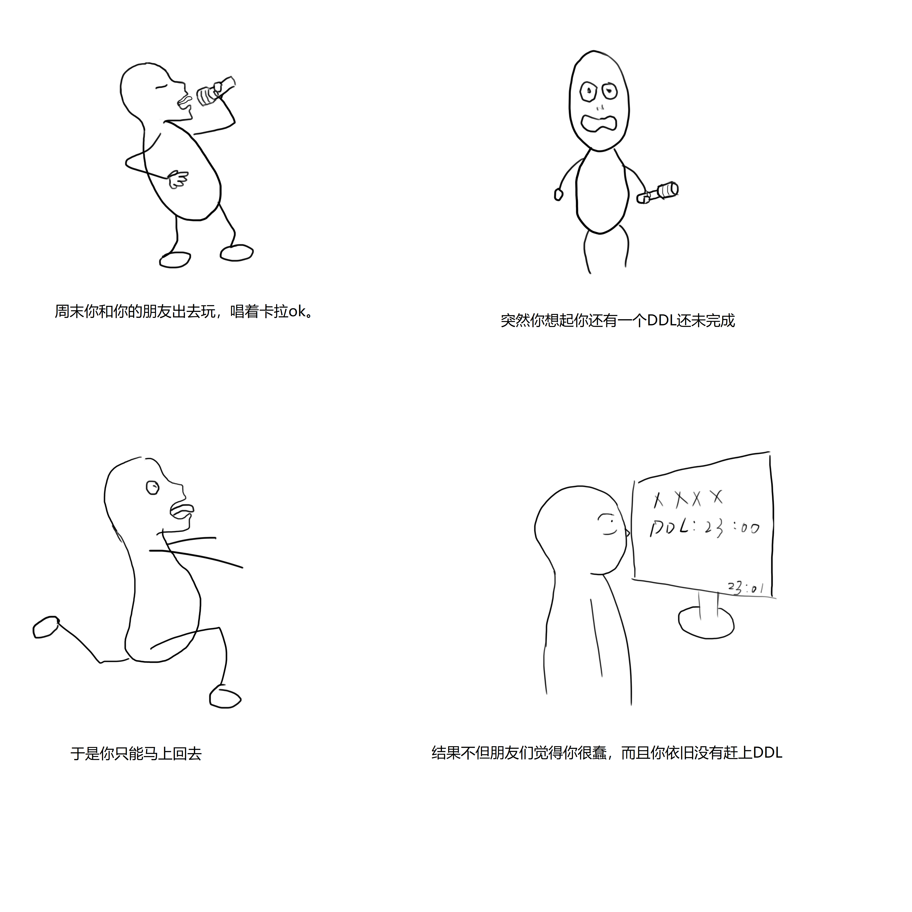
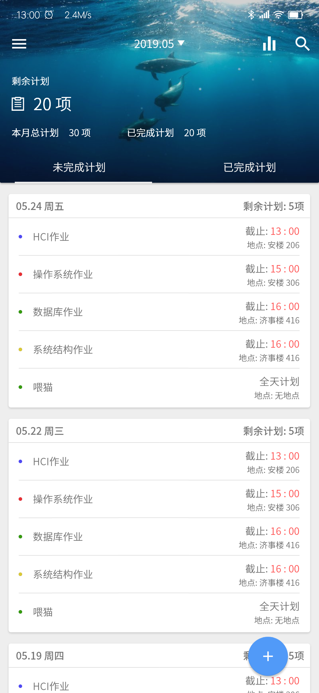
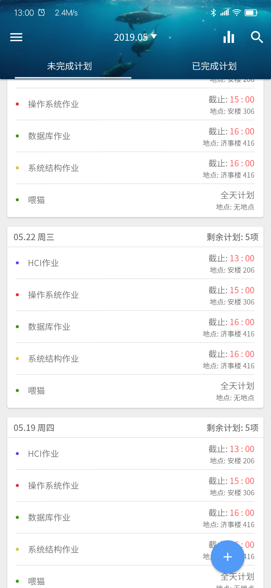
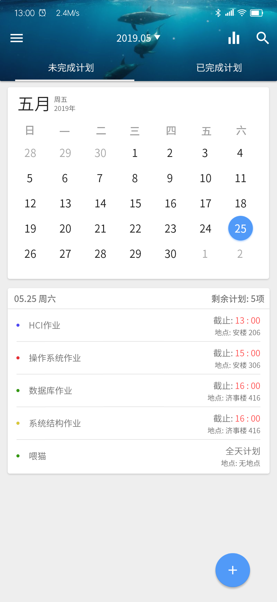
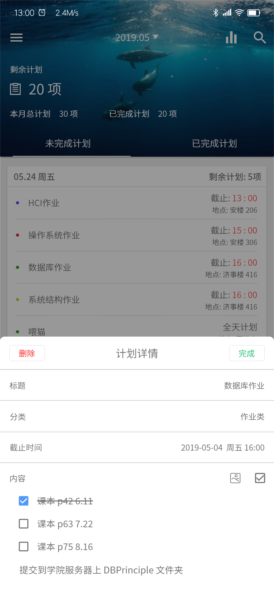
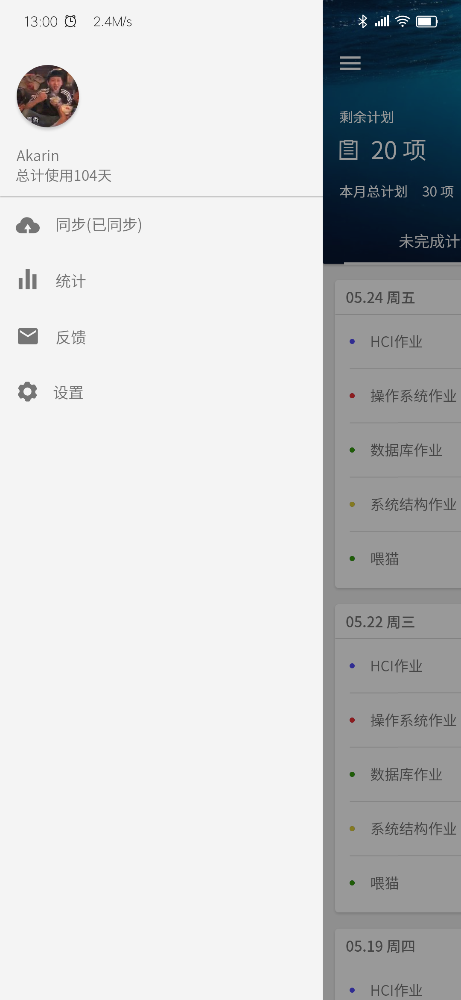

# HCI 原型设计作业

>任务提醒与时间管理系统

  

--------

## 1. 场景描述与需求分析

现在, 人们的学习工作节奏日趋加快、任务更加繁杂. 面对每天众多的日程安排, 单单依靠人脑已经难以记忆, 但是又不得不进行记录和规划. 因此, 利用手机进行记录是一个既方便又明确的手段. 那么, 一款合适的APP程序必不可少.  

鉴于我们是学生, 对学生的需求更加了解. 因此我们的重点目标是记录每日的DDL（截止日期）, 以及DDL的内容和提交方式. 

###### 故事板: 

## 2. 预期功能点

### 展示任务

打开APP时立即展示当日的所有未完成任务.  

### 查看任务详情

可对每一条任务查看详情.  

### 新增任务

当然, 必须可以新增任务.  

### 日历功能

选择查看某日的日程.  

### 自动同步功能

避免数据丢失.  

### 统计功能

统计每日的未完成任务和每月已完成、未完成和总任务数.  

### 搜索功能

搜索某个任务事件. 

## 3. 功能生成

### 展示任务

打开APP, 立即将当日任务作为卡片展示.  

### 查看任务详情

可对每一条任务查看详情.  

### 新增任务

点击右下角“+”号, 输入任务的必要内容, 确认即可.  

### 日历功能

点击上方下三角或右划进入日历后选择查看某日的日程.  

### 自动同步功能

在确认添加一条任务或完成一条任务后同步变化数据.  

## 4. 完成后的讨论

我们认为我们的APP完成了一款面向学生的任务管理软件应该完成的所有基础功能, 添加任务、在显眼的位置展示当前任务、从日历选择日期展示任务、以及同步功能. 而且, 我们有统计与搜索两个附加功能, 可以让用户判断自己任务完成的情况和搜索某个任务的具体内容. 
不足之处在于, 若某项任务在DDL前未完成, 我们没有让它出现在显眼的位置供用户处理. 

## 5. 原型设计

